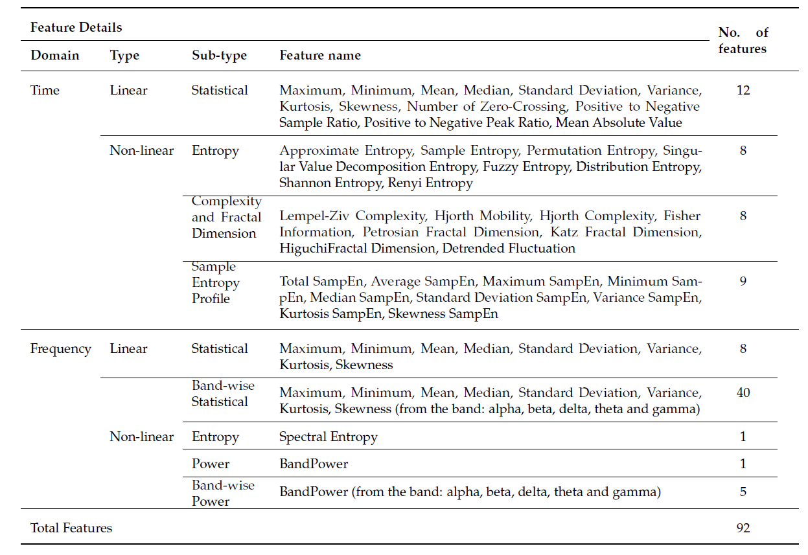

# DIHC_FeatureManager


## About the project
Contributor: Emran Ali

Email: emran.ali@research.deakin.edu.au

Involvement: Deakin University- Innovation in Healthcare (DIHC) (GitHub: https://github.com/Innovation-in-Healthcare)


## Description
This library was initially developed for personal and team research applications targeting the processing and analysis of EEG signal data.


#### Target tasks
Feature engineering and other feature management-related tasks. 

This library provides a variety of functionalities starting from feature extraction, 
feature selection and other feature management and engineering-related tasks.
This Feature Manager project has been developed as part of feature engineering for 
Machine Learning models. 
<br>
Main functionalities include:
<ol>
  <li>Data segmentation</li>
  <li>Feature extraction</li>
  <li>Extropy profiling (profile data extraction)</li>
  <li>Feature selection (not completed yet)</li>
</ol>

#### Note: 
<ol>
  <li>This is not a complete library and we are continuously adding content to it. Until now, only the signal segmentation and feature extraction part has been completed.</li>
  <li><strike>For Fuzzy entropy, Distribution entropy and Sample entropy profile features Matlab engine needs to be installed. For more instructions, please see "Integrate_Matlab_in_Python.txt".</strike> This version now contains complete Python based feature extraction methods. No matlab is required now.</li>
</ol>


## 1. Data Segmentation

### All Methods 
<ol type="a">
  <li>get_segments_for_data()</li>
</ol>

#### a. get_segments_for_data() | Segmentation
From a long signal data, it segments the signal data.  <br> 
It has different parameters to control the segmentation process. <br>

Takes- data, segment_length, segment_overlap, signal_frequency 

Returns- 2D np.array 

It generates controlled segments based on the criteria of window length, overlapping etc.
It returns a 2D numpy array containing the data points in the inner dimension and the number of segments stacked over the outer dimension.
  

###### Arguments
-------------------------------------
- data : np.array <list like 1D array>

    The signal data in a 1D numpy array for which the features will be extracted

###### Arguments (Optional)
-------------------------------------
- segment_length: None/int -(in second, default=entire signal)

    Segment length that should be used to do windowing of the signal
    
- segment_overlap: int -(in \%, default=0, related to=segment_length)

    Segment overlapping percentage that should be used to do windowing of the signal
    
- signal_frequency: int -(in Hz, default=256)

    Sampling frequency of the signal


###### Return
-------------------------------------
- 2D np.array -(np.array, default=None)

     2D numpy array containing the data points in the inner dimension (column-wise) and the number of segments stacked over the outer dimension (row-wise).


###### Application (Code Examples) 
-------------------------------------
    ##### Importing necessary modules
    from DIHC_FeatureManager.DIHC_FeatureManager import *

    
    ##### Load data to an 1D np.array 
    samp_data = np.array(...)
    
    ##### Set sampling frequency
    sig_freq = 256
    
    ##### Create a Feature Manager object
    feat_manager = DIHC_FeatureManager()
    
    ##### Call function to get 5-second non-overlapping segments
    feat_df = feat_manager.get_segments_for_data(samp_data, segment_length=5, signal_frequency=sig_freq)
        
    ##### Call function to get 5-second 20% overlapping segments
    feat_df = get_segments_for_data(samp_data, segment_length=5, segment_overlap=20, signal_frequency=sig_freq)
        
    ##### feat_df will have the list of features in a 2D np.array 
    feat_df


## 2. Feature Extraction

### Features:
It contains the following features:



### List of feature types: 'feature_names' parameters 
|Feature name to use | Details of the feature|
|:----|:----|
|tdLinStt | Time-domain linear statistical features|
|tdLin | Time-domain linear features|
|tdNlEn | Time-domain non-linear Entropy features|
|tdNlComFD | Time-domain non-linear Complexity and Fractal dimension features|
|tdNlEnSamProf | Time-domain non-linear Sample entropy-based secondary features features|
|tdNl  | Time-domain non-linear features|
|td  | Time-domain features|
|fdLinStt  | Frequency-domain linear statistical features|
|fdLinSttBnd | Frequency-domain linear band-wise statistical features|
|fdLin | Frequency-domain linear features|
|fdNlEn | Frequency-domain non-linear entropy features|
|fdNlPw | Frequency-domain non-linear (spectral) power features|
|fdNlPwBnd | Frequency-domain non-linear band-wise (spectral) power features|
|fdNlAllPw | Frequency-domain non-linear (spectral) power features including band-wise power|
|fdNl | Frequency-domain non-linear features|
|fd | Frequency-domain features|
|all| All features|

As mentioned in the "Features" subsection above.


### All Methods 
<ol type="a">
  <li>extract_features_from_data()</li>
  <li>extract_features_from_segments()</li>
</ol>

#### a. extract_features_from_data() | Segmentation + Feature Extraction 
From a long signal data, it segments the signal data first and then extracts features for all the generated segments.  <br> 
It has different parameters to control the segmentation process and the type of features that the user wants to extract. <br>

Takes- data, feature_names, segment_length, segment_overlap, signal_frequency, filtering_enabled, lowcut, highcut, manage_exceptional_data 

Returns- <pandas.DataFrame> 

It generates features based on the data provided and other criteria of the names of the features, window length, sampling frequency etc.
It returns a pandas DataFrame containing the feature names (column-wise) and the features for the data points (row-wise).
  

###### Arguments
-------------------------------------
- data : np.array <list like 1D array>

    The signal data in a 1D numpy array for which the features will be extracted

###### Arguments (Optional)
-------------------------------------
- feature_names: list(enum:FeatureType) -(list, default=all)

    List of features that are to be extracted. More about it is described in the "List of feature types" 
    
- segment_length: None/int -(in second, default=entire signal)

    Segment length that should be used to do windowing of the signal
    
- segment_overlap: int -(in \%, default=0, related to=segment_length)

    Segment overlapping percentage that should be used to do windowing of the signal
    
- signal_frequency: int -(in Hz, default=256)

    Sampling frequency of the signal
    
- filtering_enabled: bool -(True/False, default=False)

    If the high, low or band-pass filters should be applied for frequency domain features
    
- lowcut: int (in Hz, default=1, related to=filtering_enabled)

    The low-cut frequency for filtering
    
- highcut: int (in Hz, default=48, related to=filtering_enabled)

    The high-cut frequency for filtering
    
- <strike>has_matlab_engine: bool -(True/False, default=True, related to=filtering_enabled)</strike>

    <strike>Has the Matlab engine for Python been set up, False if doesn't have Matlab installed and configured. As a result, Fuzzy, Distribution and Entropy Profile related features will be excluded</strike> 

[comment]: <> (- manage_exceptional_data: int -&#40;0-3, default=0&#41;)
  
[comment]: <> (    If wanted to deal with empty or null data)


###### Return
-------------------------------------
- pandas.DataFrame -(pandas.DataFrame, default=None)

    List of features that are to be extracted. More about it is described in the "List of feature types" 


###### Application (Code Examples) 
-------------------------------------
    ##### Importing necessary modules 
    from DIHC_FeatureManager.DIHC_FeatureManager import *

    ##### Load data to an 1D np.array 
    samp_data = np.array(...)
    
    ##### Set sampling frequency 
    sig_freq = 256
    
    ##### Create a Feature Manager object 
    feat_manager = DIHC_FeatureManager()
    
    ##### Call function to get all features 
    feat_df = feat_manager.extract_features_from_data(samp_data, segment_length=5, signal_frequency=sig_freq)
    
    <!-- ##### Call function to get all features with Matlab related features excluded
    feat_df = feat_manager.extract_features_from_data(samp_data, segment_length=5, signal_frequency=sig_freq, has_matlab_engine=False)  -->
        
    ##### Call function to get time-domain non-linear entropy features 
    feat_df = feat_manager.extract_features_from_data(samp_data, feature_names=[DIHC_FeatureGroup.tdNlEn], segment_length=5, signal_frequency=sig_freq)
        
    ##### Call function to get time-domain non-linear entropy features and frequency-domain (spectral) power features 
    feat_df = feat_manager.extract_features_from_data(samp_data, feature_names=[DIHC_FeatureGroup.tdNlEn, DIHC_FeatureGroup.fdNlPw], segment_length=5, signal_frequency=sig_freq)
        
    ##### feat_df will have the list of features in a DataFrame 
    feat_df


#### b. extract_features_from_segments() | Feature Extraction 
It extracts features from already segmented data.  <br> 
It has different parameters to control the type of features that the user wants to extract. <br>

Takes- data, feature_names, signal_frequency, filtering_enabled, lowcut, highcut, manage_exceptional_data 

Returns- <pandas.DataFrame> 

Since the segmentation is done earlier, it expects the data to be matched with the signal_frequency, the exception can be in the last segment. 
It generates features based on the data provided and other criteria of the names of the features, sampling frequency etc.
It returns a pandas DataFrame containing the feature names (column-wise) and the features for the data points (row-wise).
  

###### Arguments
-------------------------------------
- data : np.array <list like 2D array>

    The signal data is in a 2D numpy array for which the features will be extracted. The outer dimension indicates the number 
  of segments and the inner dimension presents the data points in a particular segment.

###### Arguments (Optional)
-------------------------------------
- feature_names: list(enum:FeatureType) -(list, default=all)

    List of features that are to be extracted. More about it is described in the "List of feature types" 
    
- signal_frequency: int -(in Hz, default=256)

    Sampling frequency of the signal
    
- filtering_enabled: bool -(True/False, default=False)

    If the high, low or band-pass filters should be applied for frequency domain features
    
- lowcut: int (in Hz, default=1, related to=filtering_enabled)

    The low-cut frequency for filtering
    
- highcut: int (in Hz, default=48, related to=filtering_enabled)

    The high-cut frequency for filtering
    
- <strike>has_matlab_engine: bool -(True/False, default=True, related to=filtering_enabled)</strike>

    <strike>Has the Matlab engine for Python been set up, False if doesn't have Matlab installed and configured. As a result, Fuzzy, Distribution and Entropy Profile related features will be excluded </strike>

[comment]: <> (- manage_exceptional_data: int -&#40;0-3, default=0&#41;)
  
[comment]: <> (    If wanted to deal with empty or null data)


###### Return
-------------------------------------
- pandas.DataFrame -(pandas.DataFrame, default=None)

    List of features that are to be extracted. More about it is described in the "List of feature types" 


###### Application (Code Examples) 
-------------------------------------
    ##### Importing necessary modules 
    from DIHC_FeatureManager.DIHC_FeatureManager import *

    ##### Load data to an 2D np.array 
    samp_data = np.array(...)
    
    ##### Set sampling frequency 
    sig_freq = 256
    
    ##### Create a Feature Manager object 
    feat_manager = DIHC_FeatureManager()
    
    ##### Call function to get all features 
    feat_df = feat_manager.extract_features_from_segments(samp_data, segment_length=5, signal_frequency=sig_freq)
    
    <!-- ##### Call function to get all features with Matlab-related features excluded
    feat_df = feat_manager.extract_features_from_segments(samp_data, segment_length=5, signal_frequency=sig_freq, has_matlab_engine=False) -->
        
    ##### Call function to get time-domain non-linear entropy features 
    feat_df = feat_manager.extract_features_from_segments(samp_data, feature_names=[DIHC_FeatureGroup.tdNlEn], segment_length=5, signal_frequency=sig_freq)
        
    ##### Call function to get time-domain non-linear entropy features and frequency-domain (spectral) power features 
    feat_df = feat_manager.extract_features_from_segments(samp_data, feature_names=[DIHC_FeatureGroup.tdNlEn, DIHC_FeatureGroup.fdNlPw], segment_length=5, signal_frequency=sig_freq)
        
    ##### feat_df will have the list of features in a DataFrame 
    feat_df


#### z. <span style="color:red"> Warnig: </span>
For smaller data/data segments, this above code works perfectly fine. 
However, for larger data/data segments, the code will take a lot of time to run due to the extreme complexity of some feature calculation.
Sometimes even may lead to memory (exhaustion) error. 
We are gradually improving the code to add memory and speed optimisations.
But for now, to deal with that, we recommend to use the function ``DIHC_FeatureGroup.remove_computationally_expensive_features( comp_exp_list_index=level_of_complexity )` to remove computationally expensive features and select the other features. 
``level_of_complexity`` is an integer that defines the level of complexity of the features that are to be removed. 
The higher the value, the more computationally expensive features are removed. 
The following list shows the complexity of the features:

|level_of_complexity | Details of the feature                                        |
|:----|:--------------------------------------------------------------|
|5 | Distribution Entropy, and all Sample Entropy Profile features |
|4 | Frequency-domain non-linear all Band Power features           |
|3 | Sample Entropy, and Fuzzy Entropy features                    |
|2 | Approximate Entropy feature                                   |
|1 | Shannon Entropy, and Renyi Entropy features                   |


## 3. Extropy profiling (profile data extraction) 

### Entropy profile of KS entropy group:
Kolmogorov-Shenai (KS) entropy group contains several entropy including Approximate and Sample entropy. 
A profile is a list of dynamic values for a specific entropy based on the data instead of one single value [2]. 
The Sample entropy profile is implemented and the entire profile for Sample entropy (SampEn) can be achieved using the functions from this section. 


### All Methods 
<ol type="a">
  <li>extract_sampEn_profile_from_data()</li>
</ol>


#### a. extract_sampEn_profile_from_data() | Sample Entropy Profile extraction 
From a long signal data, it segments the signal data first and then extracts the Sample entropy profile for all the generated segments.  <br> 
It has different parameters to control the segmentation process. <br>

Takes- data, segment_length, segment_overlap, signal_frequency  

Returns- <pandas.DataFrame> 

It generates the Sample entropy profile based on the data provided and other criteria of the names of the features, window length, sampling frequency etc.
It returns a pandas DataFrame containing the segment serial number (column-wise) and the Sample entropy profile values for the data points (row-wise).
  

###### Arguments
-------------------------------------
- data : np.array <list like 2D array>

    The signal data is in a 2D numpy array for which the features will be extracted. The outer dimension indicates the number 
  of segments and the inner dimension presents the data points in a particular segment.

###### Arguments (Optional)
-------------------------------------    
- segment_length: None/int -(in second, default=entire signal)

    Segment length that should be used to do windowing of the signal
    
- segment_overlap: int -(in \%, default=0, related to=segment_length)

    Segment overlapping percentage that should be used to do windowing of the signal
    
- signal_frequency: int -(in Hz, default=256)

    Sampling frequency of the signal
    
- <strike>has_matlab_engine: bool -(True/False, default=True, related to=filtering_enabled)</strike>

    <strike>Has the Matlab engine for Python been set up, False if doesn't have Matlab installed and configured. As a result, the Entropy Profile cannot be extracted. Although it is optional right now, it needs to be true to get the Entropy Profile </strike> 

[comment]: <> (- manage_exceptional_data: int -&#40;0-3, default=0&#41;)
  
[comment]: <> (    If wanted to deal with empty or null data)


###### Return
-------------------------------------
- pandas.DataFrame -(pandas.DataFrame, default=None)

    A DataFrame containing the list of segment serial numbers and the corresponding Sample entropy profile data for each segment 


###### Application (Code Examples) 
-------------------------------------
    ##### Importing necessary modules 
    from DIHC_FeatureManager.DIHC_FeatureManager import *

    ##### Load data to an 2D np.array 
    samp_data = np.array(...)
    
    ##### Set sampling frequency 
    sig_freq = 256
    
    ##### Create a Feature Manager object 
    feat_manager = DIHC_FeatureManager()
    
    ##### Call function to get Sample entropy profile data for a 5-second segment with a 2-second overlap 
    entProf_df = feat_manager.extract_sampEn_profile_from_data(samp_data, segment_length=5, segment_overlap=2, signal_frequency=sig_freq)
    
    ##### Call function to get Sample entropy profile data for a 5-second segment with no overlap 
    <!-- # entProf_df = feat_manager.extract_sampEn_profile_from_data(samp_data, segment_length=5, signal_frequency=sig_freq, has_matlab_engine=True) -->
    # entProf_df = feat_manager.extract_sampEn_profile_from_data(samp_data, segment_length=5, signal_frequency=sig_freq)
    
    ##### feat_df will have the Sample entropy profile data in a DataFrame 
    entProf_df


#### z. <span style="color:red"> Warnig: </span>
For the same reason of larger data as explained in the previous section, this code may experience errors. 
Hence, entropy profile values cannot be generated.  


## 4. Feature Selection
(Yet to implement)


## Declaration
This is a simplified library initially developed for personal and limited community use. 
It is not bug-free and going through continuous evaluation & updates, please use it on your own responsibility.
Please let us know if any bug has been spotted and don't forget to acknowledge if it is found helpful. 


## Dependencies
1. Antropy: https://github.com/raphaelvallat/antropy
2. PyEEG: https://github.com/forrestbao/pyeeg
3. Other libraries that it is derived from:  numpy, pandas, scipy, scikit-learn, numba, stochastic, antropy, mne 
4. <strike>Matlab Engine: (for some features)</strike> Now all the fetures are calculated using only Python, no matlab is required.


## About
Version: 0.12.0

Stage: Beta


## Citation  
If you use this library, please cite the following papers: 
1. Ali E, Angelova M, Karmakar C. Epileptic seizure detection using CHB-MIT dataset: The overlooked perspectives. Royal Society Open Science. 2024 May;11(6):230601.
   DOI:```https://doi.org/10.1098/rsos.230601```
2. Ali E, Udhayakumar RK, Angelova M, Karmakar C. Performance analysis of entropy methods in detecting epileptic seizure from surface electroencephalograms. In2021 43rd Annual International Conference of the IEEE Engineering in Medicine & Biology Society (EMBC) 2021 Nov 1 (pp. 1082-1085). IEEE.
   DOI:```https://doi.org/10.1109/EMBC46164.2021.9629538```
3. R. K. Udhayakumar, C. Karmakar and M. Palaniswami, "Understanding Irregularity Characteristics of Short-Term HRV Signals Using Sample Entropy Profile," in IEEE Transactions on Biomedical Engineering, vol. 65, no. 11, pp. 2569-2579, Nov. 2018.
    DOI:```https://doi.org/10.1109/TBME.2018.2808271``` 


## Acknowledgement
Some of the features are derived from the following sources. Let's appreciate all the authors of these libraries and papers. 
1. https://raphaelvallat.com/antropy/build/html/index.html
3. https://doi.org/10.1109/TBME.2018.2808271
4. https://doi.org/10.1371/journal.pone.0193691 


