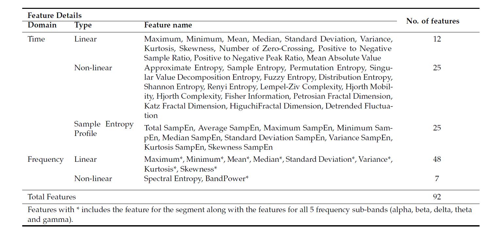

# DIHC_FeatureManager

## Project Name: DIHC_FeatureManager 
Contributor: Emran Ali

Involvement: Deakin- Innovation in Healthcare (DIHC)

Email: wwm.emran@gmail.com, emran.ali@research.deakin.edu.au

## What does it do?
Feature engineering and other feature management related tasks. 

This library provides a variety of functionalities starting from feature extraction, 
feature selection and other feature management and engineering related tasks.
This Feature Manager project has been developed as part of feature engineering for 
Machine Learning models. 
 
[NB: 
1. This is not a complete library and we are continuously adding contents in it.
2. For Fuzzy entropy, Distribution entropy and Sample entropy profile features Matlab engine is needed to be installed. For more instruction, please see "Integrate_Matlab_in_Python.txt".
] 

## Feature Extraction

### Features:
It contains the following features:

### Description 
#### Key Task:
The classes in this library all the functions for feature extraction and feature selection   

#### Insight:   
The functions are parametric so that the users can have the flexibility of using as they want.
    
###### Useful Methods
--------
    
- get_features_from_data()

    Takes- data, feature_names, segment_length, segment_overlap, signal_frequency, filtering_enabled, lowcut, highcut, manage_exceptional_data | Returns- <Pandas.DatFrame> | Func- Generates features based on the data provided and other criteria of the names of the features, window length, sampling frequency etc.
    It returns a pandas dataframe containing the feature names (column-wise) and the features for the data points (row-wise).
  

###### Properties
-----------
- data : np.array <list like 1D array>

    The data for which the features will be extracted

###### Optional
---------
- feature_names: list(enum:FeatureType) -(list, default=all)

    List of features that is to be extracted. More about is described in "List of feature types" 
    
- segment_length: int -(in second, default=5)

    Segment length that should be used to do windowing of the signal
    
- segment_overlap: int -(in \%, default=0, related to=segment_length)

    Segment overlapping percentage that should be used to do windowing of the signal
    
- signal_frequency: int -(in Hz, default=256)

    Sampling frequency of the signal
    
- filtering_enabled: bool -(True/False, default=False)

    If the high, low or band-pass filters should be applied
    
- lowcut: int (in Hz, default=1, related to=filtering_enabled)

    The low-cut frequency for filtering
    
- highcut: int (in Hz, default=48, related to=filtering_enabled)

    The high-cut frequency for filtering

[comment]: <> (- manage_exceptional_data: int -&#40;0-3, default=0&#41;)
  
[comment]: <> (    If wanted to deal with empty or null data)
  

### Application (Code Examples) 
    """ Importing necessary modules
    """
    from DIHC_FeatureManager.DIHC_FeatureManager import *

    
    """ Load data to an 1D np.array
    """
    samp_data = np.array(...)
    
    """ Set sampling frequency
    """
    sig_freq = 256
    
    """ Create Feature Manager object
    """
    feat_manager = DIHC_FeatureManager()
    
    """ Call function to get all features
    """
    feat_df = feat_manager.get_features_from_data(samp_data, segment_length=5, signal_frequency=sig_freq)
        
    """ Call function to get time-domain non-linear featuers
    """
    feat_df = feat_manager.get_features_from_data(samp_data, feature_names=DIHC_FeatureGroup.tdNlEn.value, segment_length=5, signal_frequency=sig_freq)
        
    """ feat_df will have the list of features in a dataframe
    """
    feat_df

## About
Version: 0.9.0

Stage: Initial beta

## Credits
Some of the features are derived from the following sources. Appreciate all the authors of these libraries and papers.
1. https://raphaelvallat.com/entropy/build/html/index.html
2. https://doi.org/10.1109/TBME.2018.2808271
3. https://doi.org/10.1371/journal.pone.0193691 

