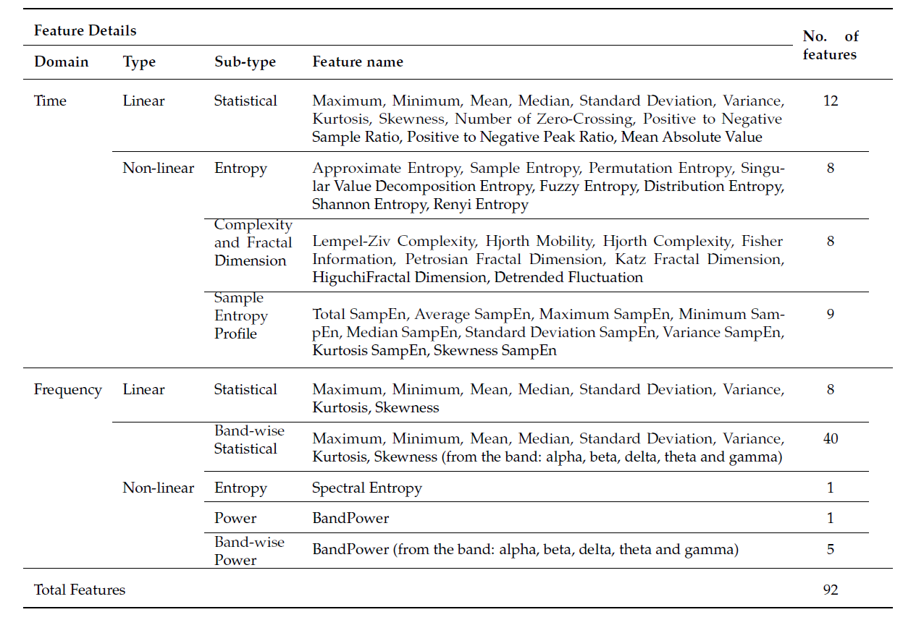

# DIHC_FeatureManager

## Project Name: DIHC_FeatureManager 
Contributor: Emran Ali

Involvement: Deakin- Innovation in Healthcare (DIHC)

Email: emran.ali@research.deakin.edu.au

Thanks to: DIHC Team

## What does it do?
Feature engineering and other feature management related tasks. 

This library provides a variety of functionalities starting from feature extraction, 
feature selection and other feature management and engineering related tasks.
This Feature Manager project has been developed as part of feature engineering for 
Machine Learning models. 
 
Main functionalities include:
<ol>
  <li>Signal segmentation</li>
  <li>Feature extraction</li>
  <li>Feature selection (not completed yet)</li>
</ol>

#### Note: 
<ol>
  <li>This is not a complete library and we are continuously adding contents in it. Until now, only the signal segmentation and feature extraction part has been completed.</li>
  <li>For Fuzzy entropy, Distribution entropy and Sample entropy profile features Matlab engine is needed to be installed. For more instruction, please see "Integrate_Matlab_in_Python.txt".</li>
</ol>

## 1. Data Segmentation

### All Methods 
<ol type="a">
  <li>get_segments_for_data()</li>
</ol>

#### a. get_segments_for_data() | Segmentation
From a long signal data, it segments the signal data.    
It has different parameters to control the segmentation process.  

Takes- data, segment_length, segment_overlap, signal_frequency 

Returns- 2D np.array 

It generates controlled segments based on the criteria of window length, overlapping etc.
It returns a 2D numpy array containing the data points in inner dimension and the number of segments stacked over the outer dimension.
  

###### Arguments
-------------------------------------
- data : np.array <list like 1D array>

    The signal data in 1D numpy array for which the features will be extracted

###### Arguments (Optional)
-------------------------------------
- segment_length: None/int -(in second, default=entire signal)

    Segment length that should be used to do windowing of the signal
    
- segment_overlap: int -(in \%, default=0, related to=segment_length)

    Segment overlapping percentage that should be used to do windowing of the signal
    
- signal_frequency: int -(in Hz, default=256)

    Sampling frequency of the signal

###### Return
-------------------------------------
- 2D np.array -(np.array, default=None)

     2D numpy array containing the data points in inner dimension (column-wise) and the number of segments stacked over the outer dimension (row-wise).

###### Application (Code Examples) 
-------------------------------------
    ##### Importing necessary modules
    from DIHC_FeatureManager.DIHC_FeatureManager import *

    
    ##### Load data to an 1D np.array 
    samp_data = np.array(...)
    
    ##### Set sampling frequency
    sig_freq = 256
    
    ##### Create Feature Manager object
    feat_manager = DIHC_FeatureManager()
    
    ##### Call function to get 5 second non-overlapping segments
    feat_df = feat_manager.get_segments_for_data(samp_data, segment_length=5, signal_frequency=sig_freq)
        
    ##### Call function to get 5 second 20% overlapping segments
    feat_df = get_segments_for_data(samp_data, segment_length=5, segment_overlap=20, signal_frequency=sig_freq)
        
    ##### feat_df will have the list of features in a 2D np.array 
    feat_df

## 2. Feature Extraction

### Features:
It contains the following features:

### List of feature types: 'feature_names' parameters 
|Feature name to use | Details of the feature|
|:----|:----|
|tdLinStt | Time-domain linear statistical features|
|tdLin | Time-domain linear features|
|tdNlEn | Time-domain non-linear Entropy features|
|tdNlComFD | Time-domain non-linear Complexity and Fractal dimension features|
|tdNlEnSamProf | Time-domain non-linear Sample entropy-based secondary features features|
|tdNl  | Time-domain non-linear features|
|td  | Time-domain features|
|fdLinStt  | Frequency-domain linear statistical features|
|fdLinSttBnd | Frequency-domain linear band-wise statistical features|
|fdLin | Frequency-domain linear features|
|fdNlEn | Frequency-domain non-linear entropy features|
|fdNlPw | Frequency-domain non-linear (spectral) power features|
|fdNlPwBnd | Frequency-domain non-linear band-wise (spectral) power features|
|fdNl | Frequency-domain non-linear features|
|fd | Frequency-domain features|
|all| All features|

As mentioned in "Features" subsection above.

### All Methods 
<ol type="a">
  <li>extract_features_from_data()</li>
  <li>extract_features_from_segments()</li>
</ol>

#### a. extract_features_from_data() | Segmentation + Feature Extraction 
From a long signal data, it segments the signal data first and then extracts features for all the generated segments.    
It has different parameters to control the segmentation process and the type of features that the user wants to extract.  

Takes- data, feature_names, segment_length, segment_overlap, signal_frequency, filtering_enabled, lowcut, highcut, manage_exceptional_data 

Returns- <pandas.DatFrame> 

It generates features based on the data provided and other criteria of the names of the features, window length, sampling frequency etc.
It returns a pandas dataframe containing the feature names (column-wise) and the features for the data points (row-wise).
  

###### Arguments
-------------------------------------
- data : np.array <list like 1D array>

    The signal data in 1D numpy array for which the features will be extracted

###### Arguments (Optional)
-------------------------------------
- feature_names: list(enum:FeatureType) -(list, default=all)

    List of features that is to be extracted. More about is described in "List of feature types" 
    
- segment_length: None/int -(in second, default=entire signal)

    Segment length that should be used to do windowing of the signal
    
- segment_overlap: int -(in \%, default=0, related to=segment_length)

    Segment overlapping percentage that should be used to do windowing of the signal
    
- signal_frequency: int -(in Hz, default=256)

    Sampling frequency of the signal
    
- filtering_enabled: bool -(True/False, default=False)

    If the high, low or band-pass filters should be applied for frequency domain features
    
- lowcut: int (in Hz, default=1, related to=filtering_enabled)

    The low-cut frequency for filtering
    
- highcut: int (in Hz, default=48, related to=filtering_enabled)

    The high-cut frequency for filtering

[comment]: <> (- manage_exceptional_data: int -&#40;0-3, default=0&#41;)
  
[comment]: <> (    If wanted to deal with empty or null data)

###### Return
-------------------------------------
- pandas.DatFrame -(pandas.DatFrame, default=None)

    List of features that is to be extracted. More about is described in "List of feature types" 

###### Application (Code Examples) 
-------------------------------------
    ##### Importing necessary modules 
    from DIHC_FeatureManager.DIHC_FeatureManager import *

    ##### Load data to an 1D np.array 
    samp_data = np.array(...)
    
    ##### Set sampling frequency 
    sig_freq = 256
    
    ##### Create Feature Manager object 
    feat_manager = DIHC_FeatureManager()
    
    ##### Call function to get all features 
    feat_df = feat_manager.extract_features_from_data(samp_data, segment_length=5, signal_frequency=sig_freq)
        
    ##### Call function to get time-domain non-linear entropy featuers 
    feat_df = feat_manager.extract_features_from_data(samp_data, feature_names=[DIHC_FeatureGroup.tdNlEn], segment_length=5, signal_frequency=sig_freq)
        
    ##### Call function to get time-domain non-linear entropy featuers and frequency-domain (spectral) power features 
    feat_df = feat_manager.extract_features_from_data(samp_data, feature_names=[DIHC_FeatureGroup.tdNlEn, DIHC_FeatureGroup.fdNlPw], segment_length=5, signal_frequency=sig_freq)
        
    ##### feat_df will have the list of features in a dataframe 
    feat_df

#### b. extract_features_from_segments() | Feature Extraction 
It extracts features from already segmented data.    
It has different parameters to control the type of features that the user wants to extract.  

Takes- data, feature_names, signal_frequency, filtering_enabled, lowcut, highcut, manage_exceptional_data 

Returns- <pandas.DatFrame> 

Since the segmentation is done earlier, it expects the data to be matched with the signal_frequency, exception can have in the last segment. 
It generates features based on the data provided and other criteria of the names of the features, sampling frequency etc.
It returns a pandas dataframe containing the feature names (column-wise) and the features for the data points (row-wise).
  

###### Arguments
-------------------------------------
- data : np.array <list like 2D array>

    The signal data in 2D numpy array for which the features will be extracted. The outer dimension indicates the number 
  of segments and the inner dimension presents the data points in a particular segment.

###### Arguments (Optional)
-------------------------------------
- feature_names: list(enum:FeatureType) -(list, default=all)

    List of features that is to be extracted. More about is described in "List of feature types" 
    
- signal_frequency: int -(in Hz, default=256)

    Sampling frequency of the signal
    
- filtering_enabled: bool -(True/False, default=False)

    If the high, low or band-pass filters should be applied for frequency domain features
    
- lowcut: int (in Hz, default=1, related to=filtering_enabled)

    The low-cut frequency for filtering
    
- highcut: int (in Hz, default=48, related to=filtering_enabled)

    The high-cut frequency for filtering

[comment]: <> (- manage_exceptional_data: int -&#40;0-3, default=0&#41;)
  
[comment]: <> (    If wanted to deal with empty or null data)

###### Return
-------------------------------------
- pandas.DatFrame -(pandas.DatFrame, default=None)

    List of features that is to be extracted. More about is described in "List of feature types" 

###### Application (Code Examples) 
-------------------------------------
    ##### Importing necessary modules 
    from DIHC_FeatureManager.DIHC_FeatureManager import *

    ##### Load data to an 2D np.array 
    samp_data = np.array(...)
    
    ##### Set sampling frequency 
    sig_freq = 256
    
    ##### Create Feature Manager object 
    feat_manager = DIHC_FeatureManager()
    
    ##### Call function to get all features 
    feat_df = feat_manager.extract_features_from_segments(samp_data, segment_length=5, signal_frequency=sig_freq)
        
    ##### Call function to get time-domain non-linear entropy featuers 
    feat_df = feat_manager.extract_features_from_segments(samp_data, feature_names=[DIHC_FeatureGroup.tdNlEn], segment_length=5, signal_frequency=sig_freq)
        
    ##### Call function to get time-domain non-linear entropy featuers and frequency-domain (spectral) power features 
    feat_df = feat_manager.extract_features_from_segments(samp_data, feature_names=[DIHC_FeatureGroup.tdNlEn, DIHC_FeatureGroup.fdNlPw], segment_length=5, signal_frequency=sig_freq)
        
    ##### feat_df will have the list of features in a dataframe 
    feat_df

## 3. Feature Selection
(Yet to implement)

## About
Version: 0.9.0

Stage: Initial beta

## Acknowledgement
Some of the features are derived from the following sources. Appreciate all the authors of these libraries and papers. Please do not forget to appreciate them.
1. https://raphaelvallat.com/antropy/build/html/index.html
2. https://doi.org/10.1109/TBME.2018.2808271
3. https://doi.org/10.1371/journal.pone.0193691 

